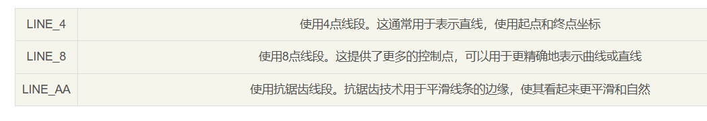
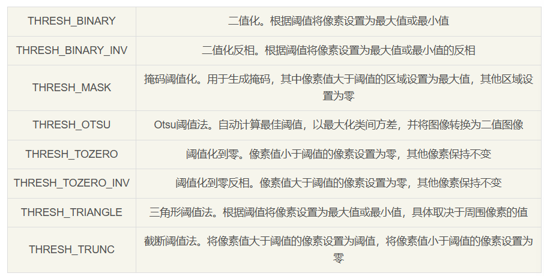

### Windows和Linux

### Scalar 标量
v0 v1 v2 v3
其中v0-v2表示BGR通道，v3表示alpha通道（通明度）

scalar.all(30) 表示v0-v3值均为30
scalar1.mul(scalar2) 两个标量相应位相乘

### Mat 矩阵
isCont 表示矩阵数据在内存中是连续存储的
isSubmat 表示这个Mat是子矩阵

mat.create(3, 3, CvType.CV_8UC1) 注意在分配内存空间的时候，并不会对内存强制清零，所以mat在create后可能含有随机值

Mat.ones() 所有元素都是1
Mat.zeros() 所有元素都是0
Mat.eye() 对角线元素都是1

mat1.assignTo(mat2) 覆盖mat2
mat.clone() 返回相同的矩阵

mat1.push_back(mat2) 将mat2的内容追加到mat1下面，注意mat1和mat2的列数要匹配

mat.put() 插入内容的起点（行、列），插入的数据，插入位置的偏移量，插入内容的长度

mat.get(row, col) 返回值为一个数组，数组长度取决于通道数，如C1，C3

mat1 = mat2.col(0) 将mat1赋值为mat2的第一列
mat1 = mat2.row(1)
mat1 = mat2.colRange(col1, col2) [col1, col2)

mat.diag() 返回mat对角线
mat.diag(val) val为正时，向右偏移；val为负时，向左偏移。

Mat.diag(mat) 以mat作为矩阵对角线上的值

submat(rolRange, colRange) 获取子矩阵

adjustROI(dtop, dbottom, dleft, dright) 如果某值为负数，则对应方向收缩一行（列）

locateROI(size, ofs) 返回ofs中x=列偏移量，y=行偏移量

mat1.convertTo(mat2, CV_type, alpha, beta) 将mat1经过处理后赋给mat2，其中alpha为乘法因子，beta为加法因子，mat2的通道数取决于mat1

mat.t() 矩阵转置

mat.reshape(channel) 如果channel=1，即为灰度图
mat.reshape(channel, row) 修改行数，注意元素总数要能够整除新的row
mat.reshape(channel, new int[]) int[]中的两个数字分别为行和列

mat1.mul(mat2) 对应位置上相乘
mat1.matMul(mat2) 矩阵乘法，注意要求mat1和mat2的元素类型为float或double

mat1.dot(mat2) 将mat1和mat2视为一维向量，计算二者的点积

mat.cols()和mat.width() 返回矩阵的宽度
mat.rows()和mat.height() 返回矩阵的高度

### Range 范围 [ )
double[] vals = {1, 2, 3, 4}
range.set(vals) 只会取数组中的前两个分别作为左边界和右边界

Range.all() range类型的最大范围

range.empty() range范围内是否有值，如果[10, 10)则为true
range1.intersection(range2) 返回二者的交集
range1 = range2.shift(delta) 将范围平移，上下限同时加减delta

### Rect 矩形 x y width height，其中x y为矩形左上角点
在openCV中，左上角为坐标系原点，x轴向右为正方向，y轴向下为正方向

rect.set(vals) 数组中前四个参数分别作为x,y,width,height
rect.area() 返回矩形的面积
rect.br() 返回矩形右下角点
rect.tl() 返回矩形左上角点

### Point 二维坐标 Point3 三维坐标

### Core
Core.absdiff(mat1, mat2, diff) 将mat1和mat2对应位置差的绝对值形成一个新矩阵diff，两个mat的大小和类型必须一致

Core.add(mat1, mat2, dst) 将mat1和mat2中相同位置相加，并将结果放到dst矩阵中

Core.scaleAdd(mat1, alpha, mat2, dst) 将mat1乘以alpha倍后与mat2相加，结果放到dst矩阵中

Core.addWeighted(mat1, alpha, mat2, beta, gamma, dst) 即alpha * mat1 + beta * mat2 + gamma = dst

Core.flip(src, dst, flipCode) flipCode=0时围绕x轴翻转，flipCode为正数时围绕y轴翻转，flipCode为负数时围绕x和y轴翻转，结果保存到dst中

Core.rotate(src, dst, ROTATE_*) 以90度的倍数旋转矩阵，ROTATE_90_CLOCKWIST顺时针旋转90度，ROTATE_90_COUNTERCLOCKWIST逆时针旋转90度，ROTATE_180旋转180度

Core.transponse(src, dst) 转置

Core.completeSymm(mat, boolean) 将一个矩阵转化为对称矩阵，如果boolean为true，则将下三角部分复制到上三角部分，mat需要满足为方阵

Core.repeat(src, x, y, dst) x y分别为沿x轴和y轴复制的次数

Core.hconcat(List src, dst) 将多张图片水平连接
Core.vconcat(List src, dst) 将多张图片垂直连接

Core.findNonZero(mat, points) 返回一个所有非黑色像素点的列表，points中包含所有内容区域的像素坐标

### Imgproc 
Imgproc.applyColorMap(src, dst, COLORMAP_*) 用于将灰度图像转换为彩色图像，增强图像的可视化效果

Imgproc.cvtColor(src, dst, int code) 将图像从一种颜色空间转换为另一种颜色空间

Imgproc.arrowedLine(Mat img, Point pt1, Point pt2, Scalar color, int thickness, int lineType, int shift, double tipLength) 绘制带箭头直线

Imgproc.line(Mat img, Point pt1, Point pt2, Scalar color, int thickness, int lineType, int shift,) 绘制普通直线

Imgproc.polylines(Mat img, List<Point> pts, boolean isClosed, Scalar color, int thickness, int lineType, int shift) 绘制多段线

Imgproc.rectangle(Mat img, Point pt1, Point pt2, Scalar color, int thickness, int lineType, int shift) 绘制矩形（thickness=-1表示填充）

Imgproc.rectangle(Mat img, Rect rect, Scalar color, int thickness, int lineType, int shift) 绘制矩形（thickness=-1表示填充）

Imgproc.circle(Mat img, Point center, int radius, Scalar color, int thickness, int lineType, int shift) 绘制圆（thickness=-1表示填充）

Imgproc.ellipse(Mat img, Point center, Size axes, double angle, double startAngle, double endAngle, Scalar color, int thickness, int lineType, int shift) 绘制椭圆

Imgproc.fillConvexPoly(Mat img, MatOfPoint points, Scalar color, int lineType, int shift) 绘制多边形

Imgproc.fillPoly(Mat img, List<Point> pts, Scalar color, int lineType, int shift, Point offset) 填充由多个多边形轮廓所包围的区域

Imgproc.drawMarker(Mat img, Point position, Scalar color, int markerType, int markerSize, int thickness, int lineType) 绘制标记

Imgproc.putText(Mat img, String text, Point org, int fontFace, double fontScale, Scalar color, int thickness, int lineType, boolean bottomLeftOrigin) 绘制文本字符串

Imgproc.clipLine(Rect rect, Point pt1, Point pt2) 线段裁定

Imgproc.fitLine(Mat points, Mat line, int distType, double param, double reps, double aeps) 拟合直线

Imgproc.fitEllipse(MatofPoint2f points) 在给定的2D点集上找到一个最佳拟合的旋转椭圆

Imgproc.matchTemplate(targetImage, templateImage, similarity, Imgproc.TM_CCOEFF_NORMED) 图像匹配，similarity为匹配度矩阵，大小为(targetImage.width()-templateImage.width) * (targetImage.height()-templateImage.height())

Imgproc.boundingRect(points) 获得内容区域的最小外界矩形

### 边缘检测 Edge Detection

#### Canny边缘检测
Canny边缘检测是一种经典的边缘检测方法，它包括多个步骤：高斯滤波、计算图像梯度、非最大抑制和双阈值化，Canny边缘检测通常被认为是准确性和低错误率的边缘检测方法
Canny(Mat image, Mat edges, double threshold1, double threshold2, int apertureSize, boolean L2gradient) 其中image是输入的图像；edges是输出的边缘图像，其大小与输入图像相同；低于threshold1的像素点不认为是边缘，高于threshold2的点认为是边缘，介于二者之间的像素点，若与边缘像素点相邻，则被认为是边缘，否则被认为不是边缘；apertureSize是Sobel算子的孔径大小；L2gradient指示是否使用L2范数来计算图像的梯度大小

基于梯度边缘检测
Canny(Mat dx, Mat dy, Mat edges, double threshold1, double threshold2, boolean L2gradient) dx和dy为输入图像的16位x和y方向导数，类型为CV_16SC1或CV_16SC3，通常使用Sobel算子计算得到

#### Sobel边缘检测
Sobel(Mat src, Mat dst, int ddepth, int dx, int dy, int ksize, double scale, double delta, int borderType) 其中ddepth表示输出图像的深度，通常是-1，表示与输入图像的深度相同；dx和dy表示对x和y方向的导数的阶数

#### Scharr边缘检测
Scharr(Mat src, Mat dst, int ddepth, int dx, int dy, double scale, double delta, int borderType)

#### Laplacian边缘检测
Laplacian(Mat src, Mat dst, int ddepth, int ksize, double scale, double delta, int borderType)

### 图像阈值化

如果使用THRESH_OTSU，则thresh不会被使用，而是由Otsu算法计算出一个使类间方差最大的阈值作为最佳分割点

Imgproc.thrshold(src, dst, double thresh, double maxval, int type) 对图像进行二值化处理
其中src为输入图像，一般是灰度图
dst为输出图像，与src大小相同
thresh为阈值
maxval当参数超过阈值时赋予的最大值
type为阈值操作类型，可使用位运算组合

Imgproc.getStructuringElement(Imgproc.MORPH_RECT, new Size(width, height)) 创建卷积核

Imgproc.morphologyEx(src, dst, op, kernel) 形态学操作的多功能函数，第三个参数决定类型

Imgproc.findContours() 会从二值化图像中提取出所有的轮廓
Imgproc.drawContours()