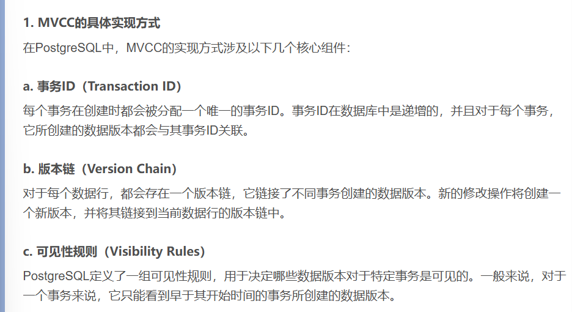
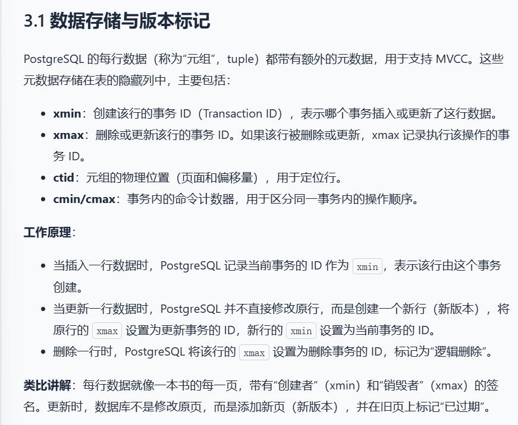
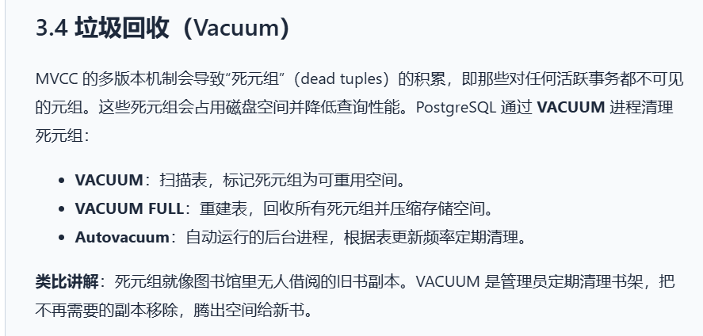

### MySQL

#### CHECK约束的添加与删除
	添加CHECK约束：ALTER TABLE 表名 ADD CONSTRAINT 约束名 (条件表达式)
	例如：ALTER TABLE course ADD CONSTRAINT check_ccredit CHECK ((Ccredit > 0) && (Ccredit < 10))
	删除CHECK约束：ALTER TABLE 表名 DROP CONSTRAINT 约束名
	例如：ALTER TABLE course DROP CONSTRAINT check_ccredit

#### 主码的添加与删除
	添加主码：ALTER TABLE 表名 ADD CONSTRAINT 约束名 PRIMARY KEY(列1，列2)
	例如：
	删除主码：ALTER TABLE 表名 DROP PRIMARY KEY
	例如：

#### 外码的添加与删除
	添加外码：ALTER TABLE 表名 ADD CONSTRAINT 约束名 外码约束
	例如：
	删除外码：ALTER TABLE 表名 DROP CONSTRAINT 约束名
	例如：ALTER TABLE course DROP CONSTRAINT Tid 

#### 创建唯一约束
	ALTER TABLE 表名 ADD CONSTRAINT 约束名 UNIQUE (列名)
	例如：ALTER TABLE teacher ADD CONSTRAINT unique_email UNIQUE (Temail)

#### 多表连接和条件查询
	SELECT 
		student.Sname, course.Cname, sc.Score, teacher.Tname 
	FROM 
		sc 
	JOIN 
		student ON sc .Sid = student .Sid 
	JOIN 
		course ON sc.Cid = course .Cid 
	JOIN
		teacher ON course.Tid = teacher.Tid 
	WHERE 
		teacher.Tgender = '女' AND
		course.Ccredit >= 3 AND
		sc.Score >= 90
	
#### 建立索引
	CREATE INDEX id_22373400 ON teacher(Tid);

#### 建立视图
	CREATE VIEW SC_22 AS
	SELECT 
		sc .Sid ,
		sc .Cid ,
		sc .Score
	FROM 
		sc 
	JOIN 
		student ON sc.Sid  = student .Sid 
	WHERE 
		SUBSTRING(CAST(sc.Sid AS CHAR), 1, 2) = '22';

#### 将编号最大的两门课程的类型改为必修
	WITH RankedCourses AS (  
		SELECT  
			Cid,  
			ROW_NUMBER() OVER (ORDER BY Cid DESC) AS rn  
		FROM  
			course  
	)  
	UPDATE course  
	INNER JOIN RankedCourses ON course.Cid = RankedCourses.Cid  
	SET course.Ctype = '必修'  
	WHERE RankedCourses.rn <= 2;

#### 将Y老师的教授的所有课的学生的成绩更改为Z分
	# score中只有Sid, Cid和Score，所以需要根据Cid找相应的课程，然后再找对应的老师
	UPDATE sc 
	SET Score = 100
	WHERE Cid  IN (  
		SELECT Cid   
		FROM course
		JOIN teacher ON course.Tid = teacher.Tid 
		WHERE teacher.Tname = '万寒'
	);

### PostgreSQL

#### 表名和字段名全部设为小写
MySQL支持大小写，postgresql需要去那全部小写

#### 默认端口为5432
端口号是一个16位的无符号整数，共有2^16 = 65536个，从0到65535

#### 本地运行
pg_ctl start 启动本地服务器

#### schema
类似于目录
在PostgreSQL中，schema(模式)是数据库对象的命名空间

#### MVCC 多版本并发控制

读取操作不会对正在进行的写操作产生阻塞，从而降低了数据库的负载，提高了读取性能。

#### PostGIS
PostgreSQL数据库的地理信息系统扩展插件

存储空间数据
POINT 点
LINESTRING 线
POLYGON 面
MULTI* 多点、多线、多边形
GEOGRAPHY 地球坐标类型，用经纬度

geom1 = geom2
PostGIS中，geometry类型重载了 = 运算符

空间计算函数
ST_Distance 计算距离
ST_Intersects 判断是否相交
ST_ShortestPath 最短路径

空间索引

#### 常用函数
ST_SetSRID(geometry, 4326) 表示将geometry设置成WGS84经纬度坐标系
ST_MakeLine(geometry, geometry) 将两个点连成一条线
ST_PointN(ST_LineString, index) 取polyline的第index个点

将两组结果垂直合并
UNION ALL 不去重，比UNION更快
UNION 会去掉重复

#### 索引
在表中创建索引，可以更快速高效地查询数据
在不读取整个表的情况下，索引可以使数据库应用程序更快地查找数据

但是更新一个包含索引的表，比更新一个没有索引的表需要更多的时间，因为索引本身也需要更新

理想的做法是仅仅在频繁被搜索的列上面创建索引

##### 索引的分类
B-tree
Hash
GiST 一种索引架构，可以在架构上实现不同的索引策略
SP-GiST
GIN 

##### CTE (Common Table Expression 公用表达式)
WITH cet_name AS (
	SELECT ...
)
SELECT *
FROM cte_name;
相当于建立一个临时表

##### LIMIT 限制返回的行数
SELECT * FROM COMPANY LIMIT 4;