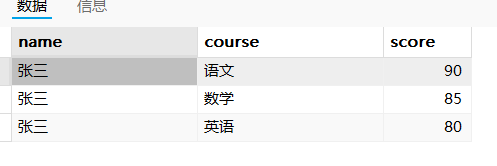

### MySQL

#### CHECK约束的添加与删除
	添加CHECK约束：ALTER TABLE 表名 ADD CONSTRAINT 约束名 (条件表达式)
	例如：ALTER TABLE course ADD CONSTRAINT check_ccredit CHECK ((Ccredit > 0) && (Ccredit < 10))
	删除CHECK约束：ALTER TABLE 表名 DROP CONSTRAINT 约束名
	例如：ALTER TABLE course DROP CONSTRAINT check_ccredit

#### 主码的添加与删除
	添加主码：ALTER TABLE 表名 ADD CONSTRAINT 约束名 PRIMARY KEY(列1，列2)
	例如：
	删除主码：ALTER TABLE 表名 DROP PRIMARY KEY
	例如：

#### 外码的添加与删除
	添加外码：ALTER TABLE 表名 ADD CONSTRAINT 约束名 外码约束
	例如：
	删除外码：ALTER TABLE 表名 DROP CONSTRAINT 约束名
	例如：ALTER TABLE course DROP CONSTRAINT Tid 

#### 创建唯一约束
	ALTER TABLE 表名 ADD CONSTRAINT 约束名 UNIQUE (列名)
	例如：ALTER TABLE teacher ADD CONSTRAINT unique_email UNIQUE (Temail)

#### 多表连接和条件查询
	SELECT 
		student.Sname, course.Cname, sc.Score, teacher.Tname 
	FROM 
		sc 
	JOIN 
		student ON sc .Sid = student .Sid 
	JOIN 
		course ON sc.Cid = course .Cid 
	JOIN
		teacher ON course.Tid = teacher.Tid 
	WHERE 
		teacher.Tgender = '女' AND
		course.Ccredit >= 3 AND
		sc.Score >= 90
	
#### 建立索引
	CREATE INDEX id_22373400 ON teacher(Tid);

#### 建立视图
	CREATE VIEW SC_22 AS
	SELECT 
		sc .Sid ,
		sc .Cid ,
		sc .Score
	FROM 
		sc 
	JOIN 
		student ON sc.Sid  = student .Sid 
	WHERE 
		SUBSTRING(CAST(sc.Sid AS CHAR), 1, 2) = '22';

#### 将编号最大的两门课程的类型改为必修
	WITH RankedCourses AS (  
		SELECT  
			Cid,  
			ROW_NUMBER() OVER (ORDER BY Cid DESC) AS rn  
		FROM  
			course  
	)  
	UPDATE course  
	INNER JOIN RankedCourses ON course.Cid = RankedCourses.Cid  
	SET course.Ctype = '必修'  
	WHERE RankedCourses.rn <= 2;

#### 将Y老师的教授的所有课的学生的成绩更改为Z分
	# score中只有Sid, Cid和Score，所以需要根据Cid找相应的课程，然后再找对应的老师
	UPDATE sc 
	SET Score = 100
	WHERE Cid  IN (  
		SELECT Cid   
		FROM course
		JOIN teacher ON course.Tid = teacher.Tid 
		WHERE teacher.Tname = '万寒'
	);

### PostgreSQL

#### 表名和字段名全部设为小写
MySQL支持大小写，postgresql需要去那全部小写

#### 默认端口为5432
端口号是一个16位的无符号整数，共有2^16 = 65536个，从0到65535

#### 本地运行
pg_ctl start 启动本地服务器

#### schema
类似于目录
在PostgreSQL中，schema(模式)是数据库对象的命名空间

#### MVCC 多版本并发控制

读取操作不会对正在进行的写操作产生阻塞，从而降低了数据库的负载，提高了读取性能。

#### PostGIS
PostgreSQL数据库的地理信息系统扩展插件

存储空间数据
POINT 点
LINESTRING 线
POLYGON 面
MULTI* 多点、多线、多边形
GEOGRAPHY 地球坐标类型，用经纬度

geom1 = geom2
PostGIS中，geometry类型重载了 = 运算符
等价于两个几何对象的坐标、SRID、点的顺序等一致

空间索引
GIST

#### 常用函数
ST_SetSRID(geometry, 4326) 表示将geometry设置成WGS84经纬度坐标系
ST_MakeLine(geometry, geometry) 将两个点连成一条线
ST_PointN(ST_LineString, index) 取polyline的第index个点

ST_ShortestPath 最短路径
ST_Intersects(geometry A, geometry B) 如果两个图形的边界或内部相交，则返回True
ST_Cross(geometry A, geometry B) 如果相交生成的几何图形的维度小于两个源几何图形的最大维度，且相交集位于两个源几何图形的内部，则返回True
ST_Overlaops(geometry A, geometry B) 如果相交生成的几何图形与两个源几何图形都不同但具有相同维度，则返回True
ST_Touches(geometry A, geometry B) 判断两个几何图形是否在它们的边界上接触，但在它们的内部不相交
ST_Within(geometry A, geometry B) 如果A完全位于B内，则返回True
ST_Contains(geometry A, geometry B) 与ST_Within()结果相反
ST_Distance(geometry A, geometry B) 计算两个几何图形之间的最短距离
ST_DWithin(geometry A, geometry B, radius) 如果A和B之间距离小于radius，则返回True
ST_X和ST_Y(geometry point) 返回点的x坐标和y坐标，输入必须是一个点

将两组结果垂直合并
UNION ALL 不去重，比UNION更快
UNION 会去掉重复

#### 索引
在表中创建索引，可以更快速高效地查询数据
在不读取整个表的情况下，索引可以使数据库应用程序更快地查找数据

但是更新一个包含索引的表，比更新一个没有索引的表需要更多的时间，因为索引本身也需要更新

理想的做法是仅仅在频繁被搜索的列上面创建索引

##### 索引的分类
B-tree
Hash
GiST 一种索引架构，可以在架构上实现不同的索引策略
SP-GiST
GIN 

##### CTE (Common Table Expression 公用表达式)
WITH cet_name AS (
	SELECT ...
)
SELECT *
FROM cte_name;
相当于建立一个临时表

##### LIMIT 限制返回的行数
SELECT * FROM COMPANY LIMIT 4;

##### && 
判断两个几何对象的外界矩形是否有重叠
用作几何粗过滤，效率非常高

#### 临时表
作用域仅局限于当前会话。
在Navicat中，打开查询，在关闭之前都算做一次会话。

#### lateral
FROM tmp_segmented_edges e2
JOIN LATERAL (
    SELECT node_id
    FROM tmp_nodes
    -- 重点在这里：这个子查询用到了外部表 e2 的数据 (e2.geom)
    ORDER BY geom <-> ST_StartPoint(e2.geom) 
    LIMIT 1
) AS n1 ON TRUE

如果不使用LATERAL，JOIN内的语句无法识别外部的e2

#### unnest
将输入的数组转换成一个临时表
select '张三' as name, unnest(Array['语文','数学','英语']) as course, unnest(Array[90,85,80]) as score;

#### 连接

#### Python连接PostgreSQL
通过建立dbconfig.yaml配置文件，能够连接数据库
	# 数据库配置文件
	username: postgres
	password: lm783412
	host: localhost
	port: 5432
	db_name: traffic_db

从数据库读取数据
	def fetch_from_database(query):
		# 读取配置文件
		with open("dbconfig.yaml", "r", encoding="UTF-8") as f:
			config = yaml.safe_load(f)

		# 连接到PostgreSQL数据库
		db_uri = f"postgresql://{config['username']}:{config['password']}@{config['host']}:{config['port']}/{config['db_name']}"
		engine = sa.create_engine(db_uri)
		conn = engine.connect()

		# 执行查询
		query_obj = sa.text(query)
		result = conn.execute(query_obj)
		conn.close()
		return result

### Redis
NoSQL类型的数据库，KV存储(Key-Value)

Key只能为字符串
Value可以为字符串、HashMap、List、Set、ZSet(有序集合)

redis-server.exe
redis-cli.exe默认连接本地6379端口

V为Sting时
set k1 v1
get k1
del k1
mset k1 v1 k2 v2
mget k1 k2

V为HashMap时
hset h1 name leon
hmset h1 name leon age 22
hget h1 name
hgetall h1
hdel h1 name
del h1

V为List时
lpush l1 v1
lpush l1 v2 v3
rpush l1 r1 r2 r3
lrange l1 0 4
lrange l1 0 -1
lpop l1
rpop l1
del l1

V为Set时
sadd s1 v1
sadd s1 v2 v3
smembers s1
del s1

V为ZSet时
略

Redis中的数据存储在内存中，不依赖于I/O，速度快。
通常用于缓存。

订阅和发布(Sub和Pub) 消息队列
SUBSCRIBE CHANNEL 
PUBLISH CHANNEL MESSAGE

SUBSCRIBE foo
PUBLISH foo hhh
PSUBSCRIBE a?b 通道的名字可以由通配符表示
PSUBSCRIBE a*b

### Sqlite
基于文件的数据库，不需要用户名、密码或主机地址