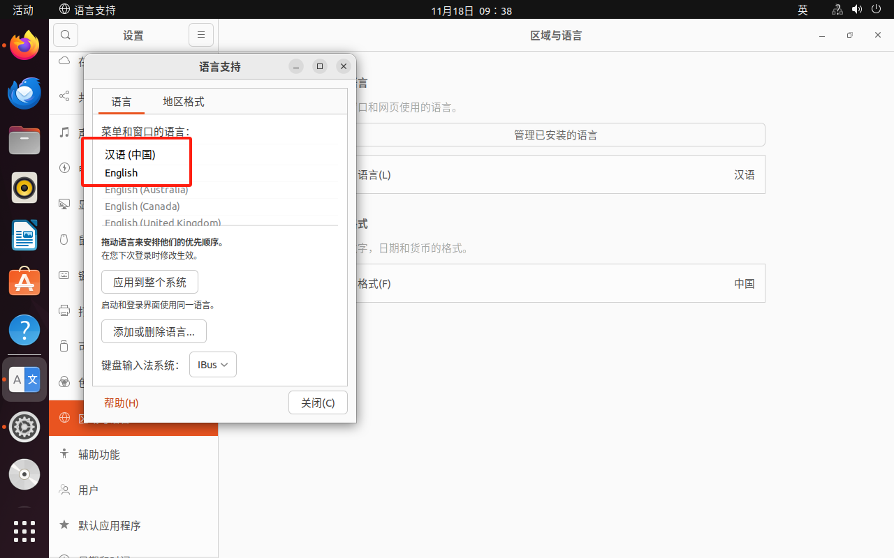
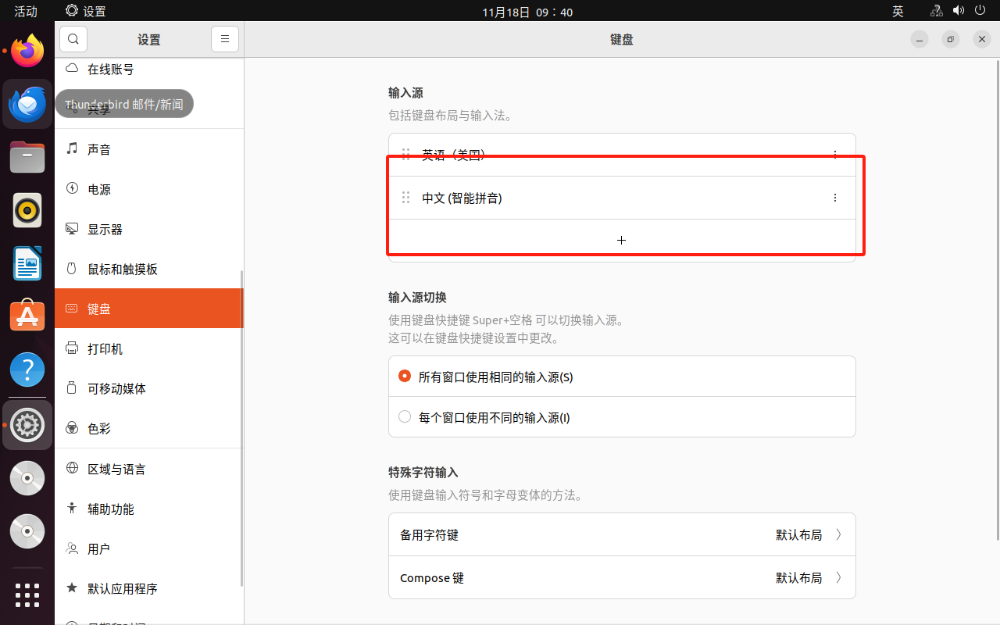
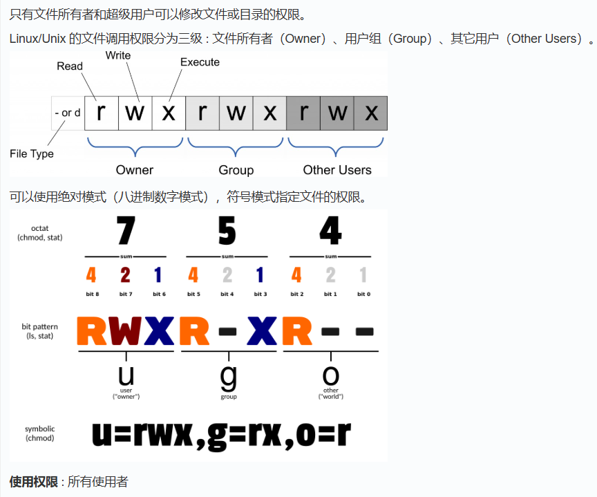

### iso文件
光盘镜像文件
ISO文件是一种光盘镜像文件，扩展名为.iso。它能够完整备份光盘的内容，包括所有数据、文件系统和目录结构，通常用于备份光盘数据或作为操作系统和软件的安装镜像文件。简单来说，ISO文件就是光盘的“数字克隆”。

### sudo 
需要先创建一个root用户
sudo passwd root

su 就可以进入root权限

Ctrl D 退出

### 查看系统版本
rename -a
cat /proc/version
lsb_release -a

### 设置中文和输入法
设置 -> region & language -> manage installed language -> 添加或删除语言 -> 找到中文(简体) -> 之后将中文的优先级拖到英文之上

重启电脑 -> 设置 -> 键盘

### 常用指令
gedit 文件名 创建文件
chmod 修改权限

