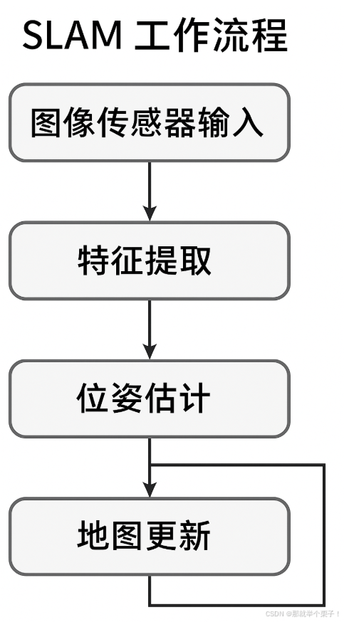

### SLAM (Simultaneous Localization And Mapping) 同步定位与建图

让一台设备在完全陌生且没有GPS的环境中，边走边构建地图，同时定位自己在哪里

#### SLAM工作流程：

#### 三大核心模块：
特称提取与匹配：提取图像关键点（如ORB、SIFT）并进行帧间匹配
位姿估计：利用匹配点计算当前相机相对于上一帧/地图的位姿
地图优化：通过Bundle Adjustment或因子图优化，提高地图一致性

#### SLAM的输入与输出
##### 输入
图像流：单目、双目或RGB-D图像序列
传感器数据：可选，如IMU、激光雷达、GPS
相机内参：焦距、主点等

##### 输出
相机位姿（轨迹）：表示机器人/相机在空间中的轨迹
地图（稀疏/稠密）：表示周围环境中的特征点/障碍物
回环检测信息：用于修正漂移、闭环优化

#### SLAM的分类
视觉SLAM：输入是相机图像，如ORB-SLAM、DSO
惯性SLAM：加入IMU传感器，如VINS-Fusion
激光SLAM：输入是激光雷达点云，如LOAM、Cartographer
多模态SLAM：相机+雷达+IMU，增强鲁棒性LVI-SLAM、FAST-LIO

### UAV (Unmanned Aerial Vehicle) 无人机