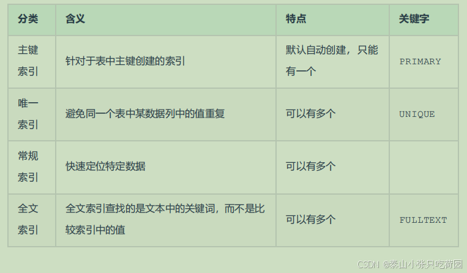

## 消息队列 Message Queue
1、消息队列的基本作用？

消息队列的主要作用是：解耦、异步、削峰。

解耦

A 系统通过接口调用发送数据到 B、C、D 三个系统。那如果现在 E 系统也要这个数据呢？那如果 C 系统现在不需要了呢？现在 A 系统又要发送第二种数据了呢？这样的话 A 系统的维护成本就非常的高，而且 A 系统要时时刻刻考虑B、C、D、E 四个系统如果出现故障该怎么办？A 系统是重发还是先把消息保存起来呢？使用消息队列就可以解决这个问题。A 系统只负责生产数据，不需要考虑消息被哪个系统来消费。

异步

A 系统需要发送个请求给 B 系统处理，由于 B 系统需要查询数据库花费时间较长，以至于 A 系统要等待 B 系统处理完毕后再发送下个请求，造成 A 系统资源浪费。使用消息队列后，A 系统生产完消息后直接丢进消息队列，不用等待 B 系统的结果，直接继续去干自己的事情了。

削峰

A 系统调用 B 系统处理数据，每天 0 点到 12 点，A 系统风平浪静，每秒并发请求数量就 100 个。结果每次一到 12 点 ~ 13 点，每秒并发请求数量突然会暴增到 1 万条。但是 B 系统最大的处理能力就只能是每秒钟处理 1000 个请求，这样系统很容易就会崩掉。这种情况可以引入消息队列，把请求数据先存入消息队列中，消费系统再根据自己的消费能力拉取消费。

2、消息队列的优缺点有哪些？

优点

消息队列的优点就是：解耦、异步、削峰。

缺点

1. 降低系统的可用性：系统引入的外部依赖越多，越容易挂掉；

2. 系统复杂度提高：使用 MQ 后可能需要保证消息没有被重复消费、处理消息丢失的情况、保证消息传递的顺序性等等问题；

3. 一致性问题：A 系统处理完了直接返回成功了，但问题是：要是 B、C、D 三个系统那里，B 和 D 两个系统写库成功了，结果 C 系统写库失败了，就造成数据不一致了。

3、如何保证消息队列的高可用？

根据不同的 MQ 或者你用过的 MQ 进行回答：

RabbitMQ：镜像集群模式

RabbitMQ 是基于主从做高可用性的，Rabbitmq有三种模式：单机模式、普通集群模式、镜像集群模式。单机模式一般在生产环境中很少用，普通集群模式只是提高了系统的吞吐量，让集群中多个节点来服务某个 Queue 的读写操作。那么真正实现 RabbitMQ 高可用的是镜像集群模式。

镜像集群模式跟普通集群模式不一样的是，创建的 Queue，无论元数据还是Queue 里的消息都会存在于多个实例上，然后每次你写消息到 Queue 的时候，都会自动和多个实例的 Queue 进行消息同步。这样设计，好处在于：任何一个机器宕机不影响其他机器的使用。坏处在于：1. 性能开销太大：消息同步所有机器，导致网络带宽压力和消耗很重；2. 扩展性差：如果某个 Queue 负载很重，即便加机器，新增的机器也包含了这个 Queue 的所有数据，并没有办法线性扩展你的 Queue。

Kafka：partition 和 replica 机制

Kafka 基本架构是多个 broker 组成，每个 broker 是一个节点。创建一个 topic 可以划分为多个 partition，每个 partition 可以存在于不同的 broker 上，每个 partition 就放一部分数据，这就是天然的分布式消息队列。就是说一个 topic 的数据，是分散放在多个机器上的，每个机器就放一部分数据。

Kafka 0.8 以前，是没有 HA 机制的，任何一个 broker 宕机了，它的 partition 就没法写也没法读了，没有什么高可用性可言。

Kafka 0.8 以后，提供了 HA 机制，就是 replica 副本机制。每个 partition 的数据都会同步到其他机器上，形成自己的多个 replica 副本。然后所有 replica 会选举一个 leader 出来，生产和消费都跟这个 leader 打交道，然后其他 replica 就是 follower。写的时候，leader 会负责把数据同步到所有 follower 上去，读的时候就直接读 leader 上数据即可。Kafka 会均匀的将一个 partition 的所有 replica 分布在不同的机器上，这样才可以提高容错性。

4、如何保证消息不被重复消费？或者说，如何保证消息消费的幂等性？

要保证消息不被重复消费，其实就是要保证消息消费时的幂等性。幂等性：无论你重复请求多少次，得到的结果都是一样的。例如：一条数据重复出现两次，数据库里就只有一条数据，这就保证了系统的幂等性。

那么如何保证幂等性呢？

1. 写数据时，先根据主键查一下这条数据是否存在，如果已经存在则 update；

2. 数据库的唯一键约束也可以保证不会重复插入多条，因为重复插入多条只会报错，不会导致数据库中出现脏数据；

3. 如果是写 redis，就没有问题，因为 set 操作是天然幂等性的。

## Redis
1、什么是 Redis？
Redis 是完全开源免费的，遵守 BSD 协议，是一个高性能的 key-value 数据库。
Redis 与其他 key - value 缓存产品相比有以下三个特点：
• Redis 支持数据的持久化，可以将内存中的数据保存在磁盘中，重启的时候可以再次加载进行使用。
• Redis 不仅仅支持简单的 key-value 类型的数据，同时还提供 list，set，zset，hash 等数据结构的存储。
• Redis 支持数据的备份，即 master-slave 模式的数据备份。

Redis 优势：
• 性能极高：Redis 能读的速度是 110000 次/s，写的速度是 81000 次/s。
• 丰富的数据类型：Redis 支持二进制案例的 Strings，Lists，Hashes，Sets 及 Ordered Sets 数据类型操作。
• 原子：Redis 的所有操作都是原子性的，意思就是要么成功执行要么失败完全不执行。单个操作是原子性的。多个操作也支持事务，即原子性，通过 MULTI 和 EXEC 指令包起来。
• 丰富的特性：Redis 还支持 publish/subscribe，通知，key 过期等等特性。

3、使用 Redis 有哪些好处？
• 速度快，因为数据存在内存中，类似于 HashMap，HashMap 的优势就是查找和操作的时间复杂度都是 O(1)
• 支持丰富数据类型，支持 string，list，set，Zset，hash 等
• 支持事务，操作都是原子性，所谓的原子性就是对数据的更改要么全部执行，要么全部不执行
• 丰富的特性，可用于缓存，消息，按 key 设置过期时间，过期后将会自动删除

33、Redis 的内存用完了会发生什么？
如果达到设置的上限，Redis 的写命令会返回错误信息（但是读命令还可以正常返回。）或者你可以将 Redis 当缓存来使用配置淘汰机制，当 Redis 达到内存上限时会冲刷掉旧的内容。

## 数据库
1、什么是视图？以及视图的使用场景有哪些
视图是一种基于数据表的一种虚表
（1）视图是一种虚表
（2）视图建立在已有表的基础上, 视图赖以建立的这些表称为基表
（3）向视图提供数据内容的语句为 SELECT 语句,可以将视图理解为存储起来的 SELECT 语句
（4）视图向用户提供基表数据的另一种表现形式
（5）视图没有存储真正的数据，真正的数据还是存储在基表中
（6）程序员虽然操作的是视图，但最终视图还会转成操作基表
（7）一个基表可以有0个或多个视图

2、索引是什么？有什么作用以及优缺点？
什么是索引（index）
（1）是一种快速查询表中内容的机制，类似于新华字典的目录
（2）运用在表中某个些字段上，但存储时，独立于表之外

3、ACID — 数据库事务正确执行的四个基本要素
包含：原子性（Atomicity）、一致性（Consistency）、隔离性（Isolation）、持久性（Durability）。

利用数据库并发控制机制以及数据库恢复机制保证事务的特性不被破坏，从而保证数据库数据的正确、有效
– 原子性由恢复机制实现
– 一致性是由事务的原子性保证的
– 隔离性通过并发控制机制实现
– 持久性通过恢复机制实现

• 事务是数据库恢复和并发控制的基本单位

4、超键、候选键、主键、外键分别是什么？
超键：在关系中能唯一标识元组的属性集称为关系模式的超键。一个属性可以为作为一个超键，多个属性组合在一起也可以作为一个超键。超键包含候选键和主键。
候选键(候选码)：是最小超键，即没有冗余元素的超键。
主键(主码)：数据库表中对储存数据对象予以唯一和完整标识的数据列或属性的组合。一个数据列只能有一个主键，且主键的取值不能缺失，即不能为空值（Null）。
外键：在一个表中存在的另一个表的主键称此表的外键。

5、SQL 约束有哪几种？
NOT NULL: 用于控制字段的内容一定不能为空（NULL）。
UNIQUE: 控件字段内容不能重复，一个表允许有多个 Unique 约束。
PRIMARY KEY: 也是用于控件字段内容不能重复，但它在一个表只允许出现一个。
FOREIGN KEY: 用于预防破坏表之间连接的动作，也能防止非法数据插入外键列，因为它必须是它指向的那个表中的值之一。
CHECK: 用于控制字段的值范围。

6.概念明晰

表现层：接受请求展示数据
*也就是我们常说的web层*。它负责接收客户端请求，向客户端响应结果，*通常客户端使用http协议请求web层*，web需要接收http请求，完成http响应。 表现层包括展示层和控制层：控制层负责接收请求，展示层负责结果的展示。 表现层依赖业务层，接收到客户端请求一般会调用业务层进行业务处理，并将处理结果响应给客户端。 表现层的设计一般都使用MVC模型。（MVC是表现层的设计模型，和其他层没有关系）

业务层：处理业务逻辑
*也就是我们常说的service层*。它负责业务逻辑处理，和我们开发项目的需求息息相关。web层依赖业务层，但是业务层不依赖web层。 业务层在业务处理时可能会依赖持久层，如果要对数据持久化需要保证事务一致性。（也就是我们说的，事务应该放到业务层来控制）

持久层：数据库交互
*也就是我们是常说的dao层*。负责数据持久化，*包括数据层即数据库和数据访问层*，数据库是对数据进行持久化的载体，数据访问层是业务层和持久层交互的接口，业务层需要通过数据访问层将数据持久化到数据库中。通俗的讲，持久层就是和数据库交互，对数据库表进行曾删改查的。

MySQL
是一个关系型数据库管理系统，分为四层：
网络连接层：提供与MySQL服务器建立的支持。
服务层：包括连接池、系统管理和控制工具、SQL接口、解析器、查询优化器等。
存储引擎层：负责MySQL中数据的存储与提取，与底层系统文件进行交互。
系统文件层：负责将数据库的数据和日志存储在文件系统之上，并完成与存储引擎的交互。

MyBatis
是一款优秀的持久层框架，它支持自定义 SQL、存储过程以及高级映射。MyBatis 免除了几乎所有的 JDBC 代码以及设置参数和获取结果集的工作。MyBatis 可以通过简单的 XML 或注解来配置和映射原始类型、接口和 Java POJO（Plain Old Java Objects，普通老式 Java 对象）为数据库中的记录。
Mybatis其实是对jdbc的操作数据库的过程进行了封装

持久层
将业务数据存储到磁盘，也具备长期存储能力，只要磁盘不损坏，如果在断电情况下，重启系统仍然可以读取数据。
持久是相对于瞬时来说的，其实就是可以把数据固化在硬盘或者磁带一类可以保存很长时间的设备上，不像放在内存中一样断电就消失了。企业应用中数据很重要(各种订单数据、客户数据、库存数据之类的)，比应用程序本身更重要，所以需要把数据持久化。持久化可以通过很多方式，写文件和数据库都可以。只是现在企业一般都会选择把数据持久化到数据库中，因为可以很方便的查询统计分析，但数据库的数据最终还是会写到磁盘上的。

JDBC
JDBC（JavaDataBase Connectivity）就是 Java 数据库连接, 说的直白点就是使用 Java 语言操作数据库
本来我们是通过控制台或客户端操作的数据库, JDBC 是用 Java 语言来发送 SQL 语句

7.索引分类

8.为什么要选择B+Tree而不是选择B-Tree作为索引的数据结构呢？
查询效率：B+树相比于B树，非叶子节点不存储数据，只存储键值，这样可以使得每个节点存储更多的键值，从而使得树的高度更低，查询时所需的磁盘I/O次数更少。

范围查询：B+树的叶子节点之间通过指针相互连接，形成一个有序的链表，这使得进行范围查询时更加高效，只需遍历叶子节点的链表即可。

磁盘I/O优化：B+树由于其结构特点，可以减少磁盘I/O操作次数，这对于数据库性能至关重要，因为磁盘I/O是数据库操作中的瓶颈之一。

高并发支持：B+树的分支节点值可以全部存放在内存中，每个叶子节点固定只指向一个聚集索引，这样的设计使得并发处理效率更高。

局部性原理：B+树将键相近的数据存储在同一个节点，当访问其中某个数据时，数据库会将该整个节点读到缓存中；当它临近的数据紧接着被访问时，可以直接在缓存中读取，无需进行磁盘IO，提高了缓存命中率。

稳定性：B+树的查询时间复杂度稳定为树高，因为所有数据都在叶节点，而B树的查询时间复杂度在1到树高之间，取决于记录在树中的位置。

存储空间利用率：B+树的非叶子节点不存储数据，使得页内可以存放更多的键值，提高了存储空间的利用率。

基于以上优势，B+树相比于B树，在数据库索引应用中更为合适，这也是MySQL的InnoDB存储引擎选择使用B+树作为索引结构的主要原因。

9.关系型数据库：mysql /oracle/sql server/sqlite 
非关系型数据库：redis / hbase /mongoDB /CouchDB /Neo4J
